  <picture>
    <source media="(prefers-color-scheme: dark)"
      srcset="https://capsule-render.vercel.app/api?type=venom&animation=twinkling&color=0d1117&height=140&text=SIDDHARTH%20DHUMAL&fontColor=ffffff&fontAlignY=35&desc=Software%20%C2%B7%20ML%20%C2%B7%20AI%20%C2%B7%20Data&descAlignY=60" />
    
  </picture>

  <picture>
    <source media="(prefers-color-scheme: dark)"
      srcset="https://readme-typing-svg.demolab.com?font=Fira+Code&size=16&pause=1200&center=true&vCenter=true&width=520&color=ffffff&background=00000000&lines=Building+clean+backend+systems;ML+tools+%2B+data+pipelines;Minimal+code%2C+maximum+signal" />
    
  </picture>

  <a href="https://linkedin.com/in/dhumal-siddharth">LinkedIn</a> ·
  <a href="mailto:siddharth.v.dhumal@gmail.com">Email</a>

  <picture>
    <source media="(prefers-color-scheme: dark)" srcset="assets/checkered-dark.svg" />
    
  </picture>

  <a href="https://github.com/Siddharth-Dhumal/BioGraphRAG">
    <picture>
      <source media="(prefers-color-scheme: dark)" srcset="assets/featured-dark.svg" />
      
    </picture>
  </a>

  
  

  <picture>
    <source media="(prefers-color-scheme: dark)"
      srcset="https://raw.githubusercontent.com/Siddharth-Dhumal/Siddharth-Dhumal/output/github-contribution-grid-snake-dark.svg" />
    
  </picture>

  <picture>
    <source media="(prefers-color-scheme: dark)"
      srcset="https://github-readme-activity-graph.vercel.app/graph?username=Siddharth-Dhumal&theme=github-dark&hide_border=true" />
    
  </picture>

